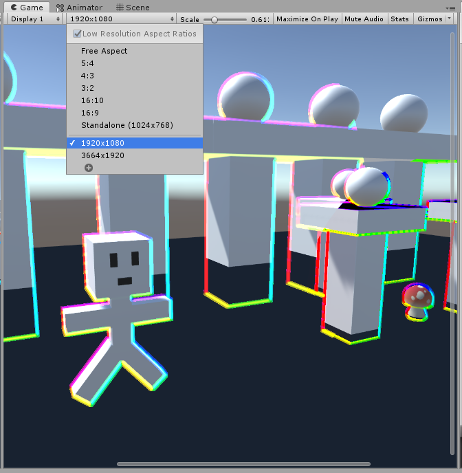
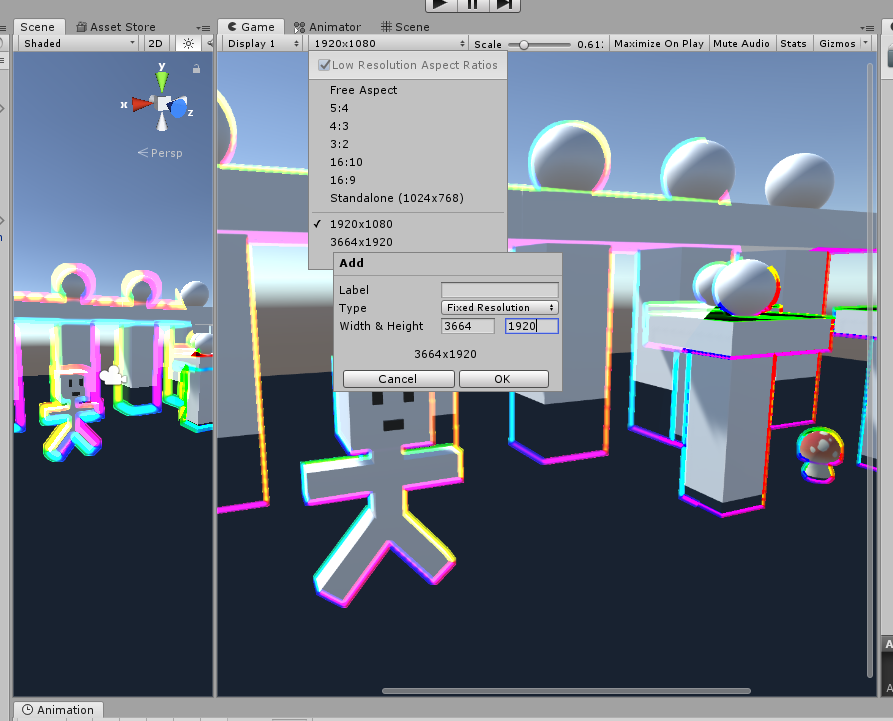

# Gaming Shroom
Hey gamers these are some mushrooms with shader effects.

Uses MIT License.

Please note that the effect appears different in the Unity Editor. In order to see the correct effect, please set the game view resolution to 1920x1080 for non-VR or to the appropriate resolution for your VR headset, i.e.: 3664x1920 for Quest 2. 

MITライセンスです。
Unity Editorでは、効果が異なって見えることに注意してください。正しい効果を見るためには、ゲームビューの解像度を非VRの場合は1920x1080に、VRヘッドセットの適切な解像度（例：Quest 2の場合は3664x1920）に設定してください。
UnityとVRChat用のRGBアウトラインエフェクトシェーダ。AudioLink版とAudioLinkなし版があります。

https://github.com/cutesthypnotist/GamingBloomShroom

