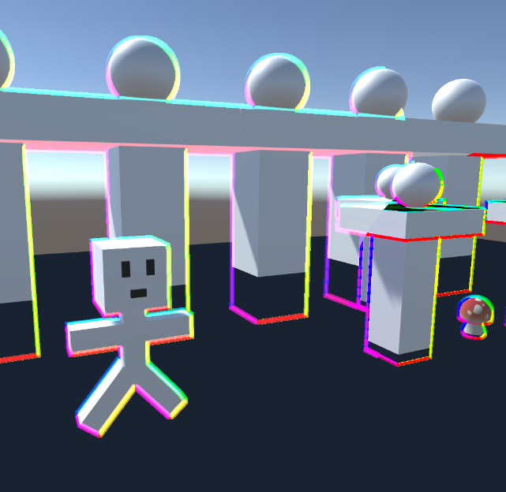
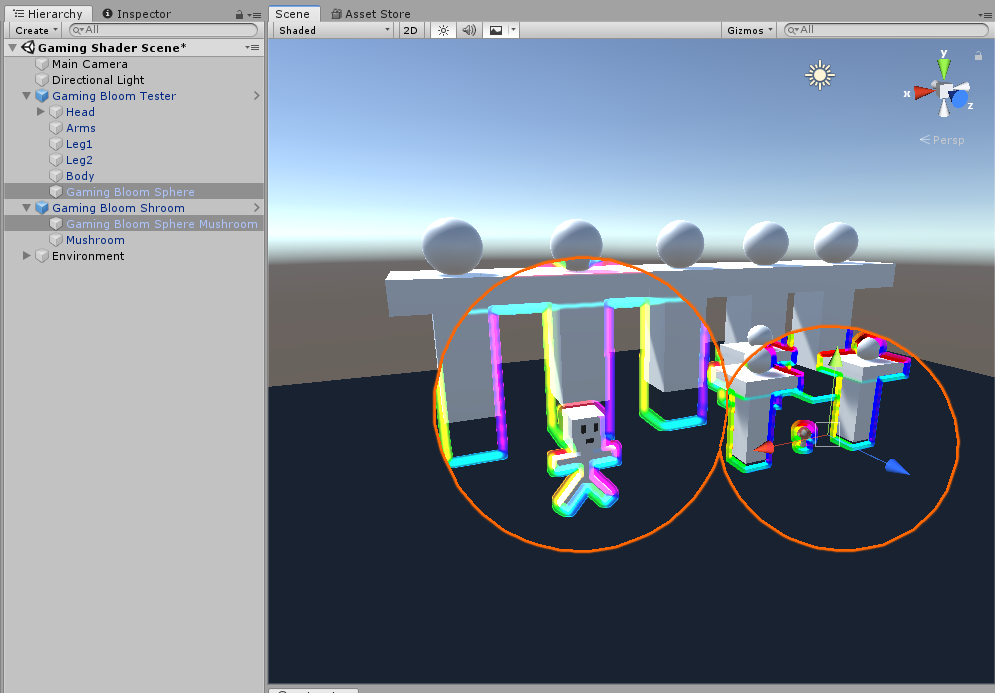

# GamingBloomShroom
RGB outline effect shaders for Unity and VRChat. AudioLink and no AudioLink versions.
Please note that the effect appears different in the scene and game views vs. in-game. You will need to set your game view resolution to 1920x1080 for non-VR or to the appropriate resolution for your VR headset, i.e.: 3664x1920 for Quest 2, to see the correct effect.

